# 🏦 Loan Prediction System AI


[**📄 View Full Project Report**](./Project%20Report/Project%20Report.docx)

[**View Model Training Part**](https://github.com/surendra-59/Loan-Prediction)

A modern, machine-learning-powered web application designed to automate and explain loan approval decisions using advanced predictive modeling and Explainable AI (XAI).

---

## 📑 Abstract

Banks and financial institutions process a large volume of loan applications on a daily basis, and the traditional approach to assessing a borrower's creditworthiness relies heavily on manual evaluation by loan officers. This manual process is time-consuming, inconsistent across evaluators, and prone to human error, which directly contributes to wrong loan approvals and a consequent rise in Non-Performing Assets (NPA) for lending institutions. 

This project, **"Loan Prediction System,"** addresses this problem by developing a machine learning-based system capable of automatically predicting whether a loan should be approved or rejected. By leveraging a high-performance **CatBoost** model (which outperformed Naive Bayes, Decision Trees, XGBoost, and LightGBM during our testing), the system provides accurate risk assessments. Furthermore, it integrates **Explainable AI (XAI)** using SHAP and counterfactual optimization to not only provide a risk score but also explain *why* a decision was made and *how* applicants can improve their financial profile.

---

## ✨ Key Features

*   **🤖 AI-Powered Risk Assessment**: Utilizes a highly trained CatBoost classifier to predict loan default probabilities with high accuracy.
*   **🔍 Explainable AI (XAI)**:
    *   **Key Factors**: Uses SHAP values to explain the specific factors (e.g., Debt-to-Income ratio, Loan Amount) driving the risk score.
    *   **Actionable AI Advisor**: Uses counterfactual optimization (via `scipy.optimize`) to generate realistic, personalized recommendations on how an applicant can improve their eligibility (e.g., reducing loan amount, increasing term).
*   **👥 Dual Role Portals**:
    *   **User Portal**: Secure login, KYC submission, intuitive multi-step loan application, and detailed AI analysis dashboard.
    *   **Banker Portal**: Comprehensive dashboard to review KYC applications, manage loan requests, and view detailed applicant risk profiles.
*   **⚡ High Performance**: Explainer logic is parallelized to ensure fast response times even during complex counterfactual optimization.

---

## 🛠️ Technology Stack

*   **Backend Framework**: Django 6.0.2
*   **Machine Learning**: CatBoost (Predictive Model), SHAP (Feature Importance), Scipy (Counterfactual Optimizer)
*   **Data Processing**: Pandas, NumPy
*   **Frontend**: HTML5, Vanilla CSS (Modern glassmorphism & gradients), JavaScript
*   **Database**: SQLite (Development) / MySQL (Production Ready)
*   **Containerization**: Docker

---

## 📂 Project Structure

```text
Loan_Prediction_System/
│
├── app/                        # Main Django application
│   ├── models.py               # Database schemas (CustomUser, KYC, LoanApplication)
│   ├── views.py                # Route handlers and parallelized processing logic
│   ├── ml_utils.py             # Data preparation pipelines for the ML model
│   ├── urls.py                 # Application routing
│   ├── templates/              # HTML templates for User and Banker portals
│   └── ...
│
├── Loan_prediction_AI/         # Django project configuration
│   ├── settings.py             # Environment and project settings
│   └── urls.py                 # Root URL configurations
│
├── static/                     # CSS, JS, and image assets
├── media/                      # Uploaded files (KYC documents, photos)
├── Screenshots/                # UI showcases and architecture diagrams
├── Project Report/             # Project report documents
│
├── cat_model.pkl               # Serialized trained CatBoost model
├── loan_explainer.py           # Core XAI logic (SHAP & Counterfactual generation)
├── nlp_explainer.py            # Natural Language Generation for AI Advisor reports
├── requirements.txt            # Python dependencies
├── pyproject.toml              # Modern Python project metadata
└── Dockerfile                  # Containerization instructions
```

---

## 📸 System Showcase

Here is a glimpse into the system's intuitive user interface:

### 1. Authentication & Dashboards

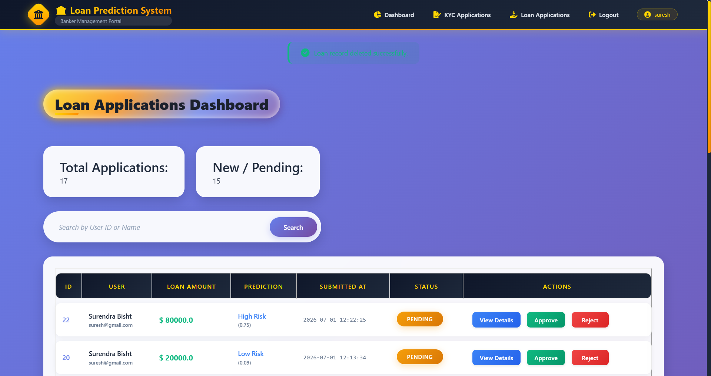
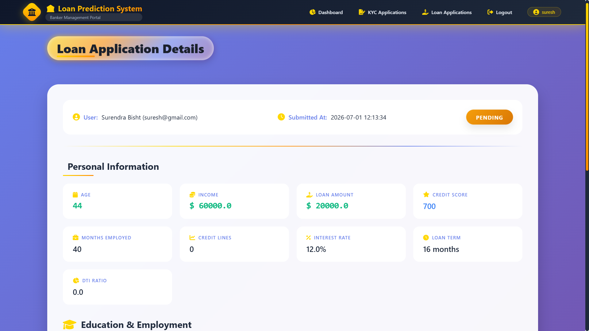

### 2. Loan Application Process (Multi-Step Form)
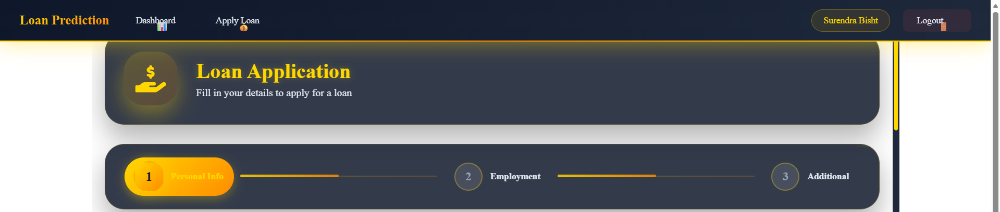
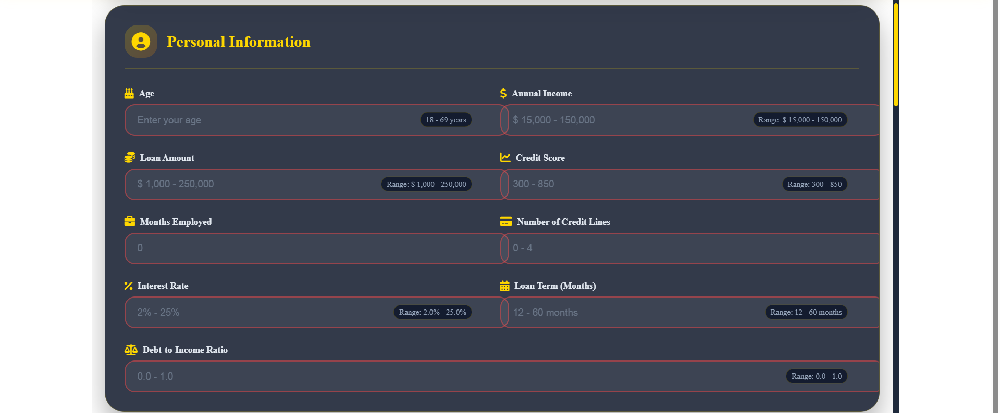
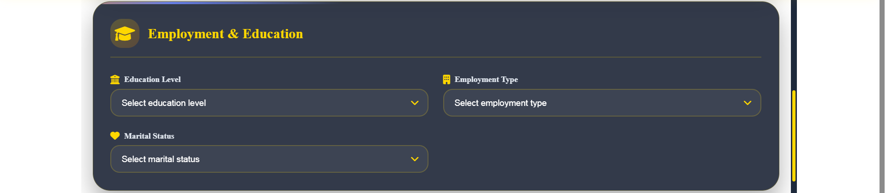
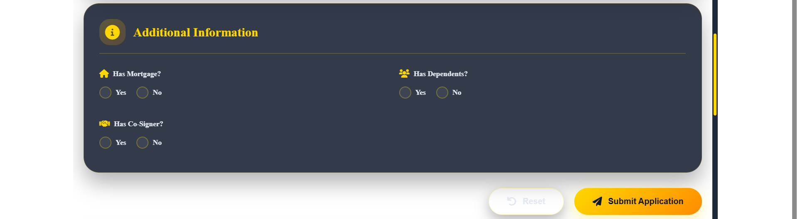

### 3. Case Study 1: First Loan Application
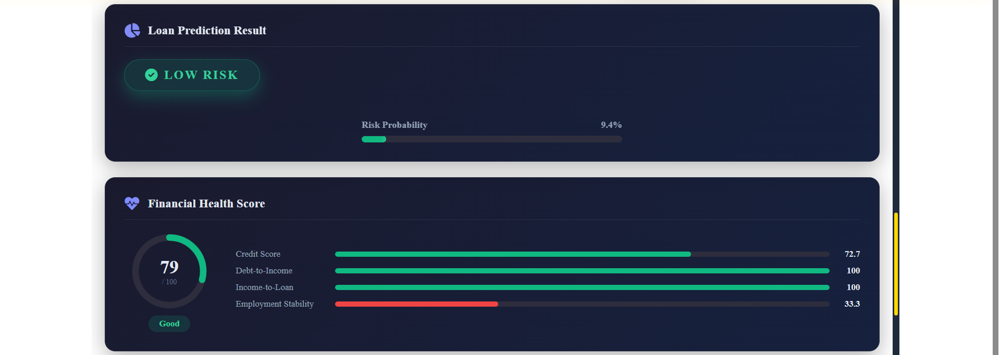
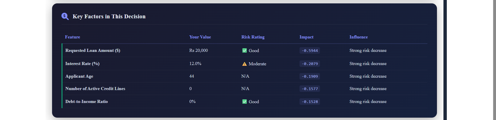
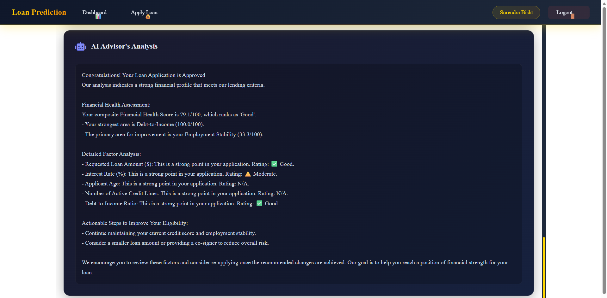

### 4. Case Study 2: Second Loan Application (With Recommendations)
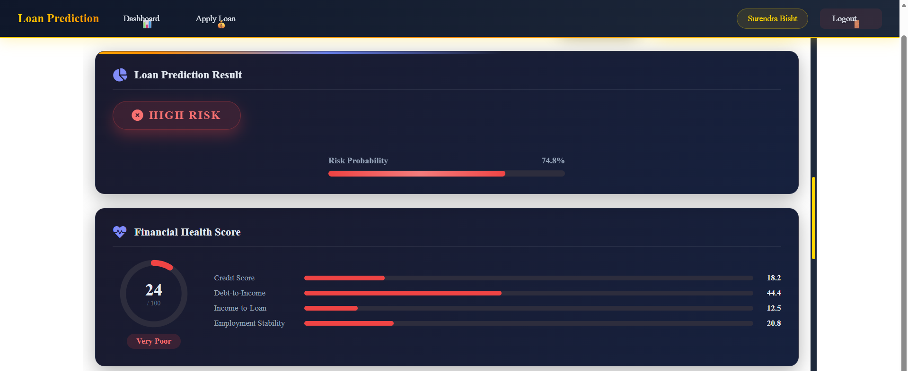
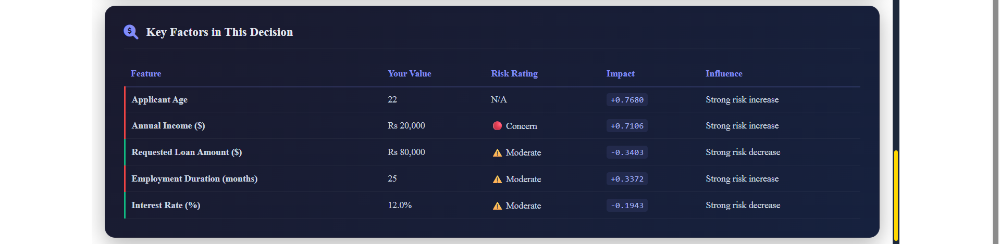
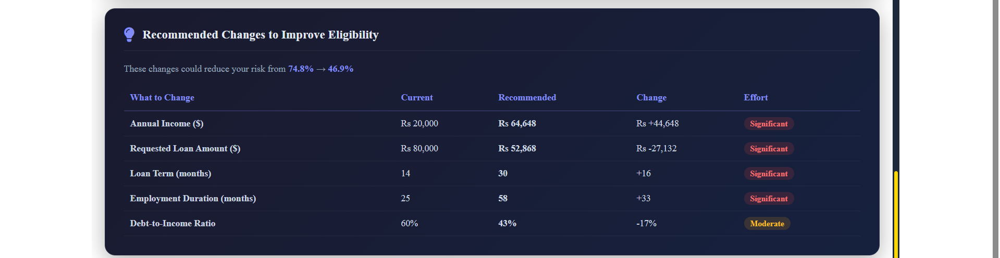
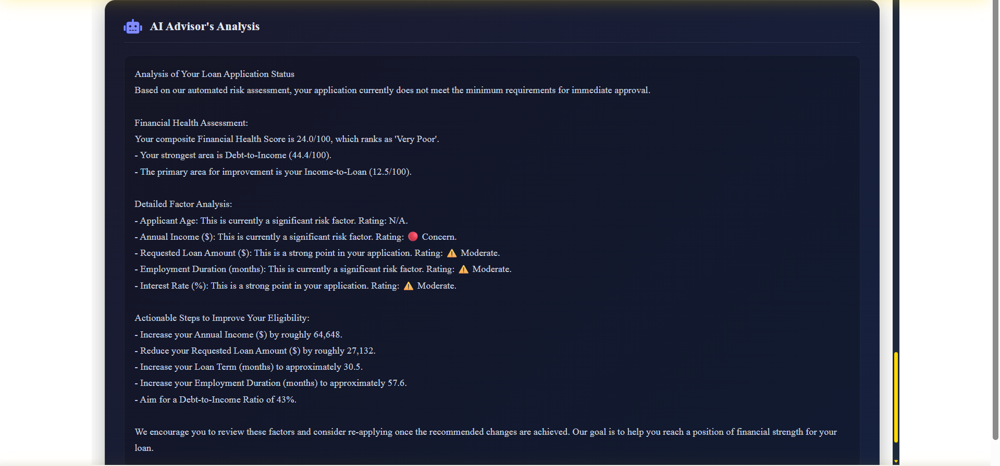

---

## 🚀 Getting Started

### Prerequisites
*   Python 3.13+
*   pip / uv package manager

### Local Installation

1.  **Clone the repository:**
    ```bash
    git clone <repository_url>
    cd Loan_Prediction_System/Loan_prediction_AI
    ```

2.  **Create a virtual environment and install dependencies:**
    ```bash
    python -m venv .venv
    source .venv/bin/activate  # On Windows: .venv\Scripts\activate
    pip install -r requirements.txt
    ```

3.  **Run Database Migrations:**
    ```bash
    python manage.py makemigrations
    python manage.py migrate
    ```

4.  **Start the Development Server:**
    ```bash
    python manage.py runserver
    ```
    Access the application at `http://127.0.0.1:8000/`.

### Running with Docker

1.  **Build the Docker image:**
    ```bash
    docker build -t loan-prediction-ai .
    ```

2.  **Run the container:**
    ```bash
    docker run -p 8000:8000 loan-prediction-ai
    ```

---

## 📊 Model Information

The core model was trained on historical loan data. Key hyperparameter bounds for real-time inference include:
*   **Income**: $15,000 - $150,000 (Dynamic bounds handled by Explainer)
*   **Loan Amount**: $1,000 - $250,000
*   **Credit Score**: 300 - 850
*   **Interest Rate**: 2.0% - 25.0%
*   **DTI Ratio**: 10% - 90%

*Note: The `loan_explainer.py` dynamically adjusts these bounds during counterfactual optimization based on the user's specific inputs to ensure logical and realistic recommendations.*
